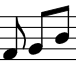

#  Music Notes & Transcription

Html links and youtube repeater to help learn songs

[Homepage](https://hiteshlala.com/music-notes)

## Engraving Tools
- [Lillypond](http://lilypond.org)
- [Hacklily](https://www.hacklily.org/)

## YouTube Video that restrict embedding

Some videos do not allow embedding.  Use [video -> mp3](https://youtubetomp3music.com/en26/) to convert to mp3.  
Then use an `<audio/>` tag to embed in html.
